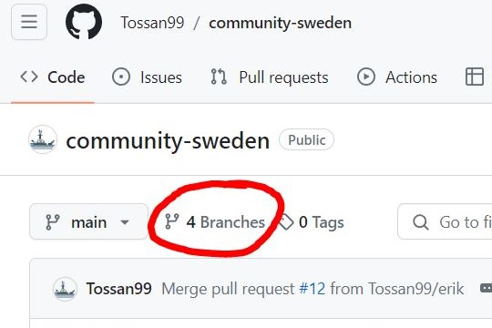
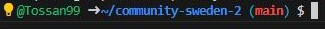

# community-sweden
test


We're thrilled to introduce you to our community-driven website, designed to support and enhance your journey through the Code Institute course. As a community passionate about learning and collaboration, we've created this platform to empower everyone to participate in coding and gain a deeper understanding of Django.

Vissit Community Sweden live website here! [Community Sweden ](https://community-sweden-cd321455620f.herokuapp.com/)

Vissit Community Sweden repository here! [Git Hub Community Sweden ](https://github.com/Tossan99/community-sweden)

## Table of Content

- [community-sweden](#community-sweden)
  * [Table of Content](#table-of-content)
  * [Getting Started](#getting-started)
    + [Branching](#branching)
    + [Merging and Pull requests](#merging-and-pull-requests)
  * [env.py](#envpy)
  * [Conventions to Follow](#conventions-to-follow)
    + [Double or Single Quotation Marks](#double-or-single-quotation-marks)
    + [Spacing](#spacing)
    + [Urls](#urls)

<small><i><a href='http://ecotrust-canada.github.io/markdown-toc/'>Table of contents generated with markdown-toc</a></i></small>


## Getting Started

### Branching

Before you start working on this project, you must create your own branch by clicking "Branches" and then the green "New branch" button. Give your branch a name associated with yourself.
<details><summary>New Branch</summary>


</details>
<br>

We are all using different IDEs, so open up the repository however you want in your IDE. Make sure you are working against your branch by typing git status in the terminal.



If it says that you're on main, switch to your branch by typing `git checkout <your branch name>`.


Before you start working, type in the command `pip3 install -r requirements.txt` to install dependencies.

### Merging and Pull requests

In order to merge your changes onto the main repository and keep everything in sync, you have to do a pull request. This will compare the differences between your branch and the main branch. If everything is compatible, you can automatically merge it. If not, someone must resolve the conflicts and approve the pull. Don't worry, all of this is easy and straightforward.

Also, it's important to know the right order of staging, committing, pulling and pushing. Pushing before pulling can cause problems on github. Conversely, pulling before you will overwrite your local code with the code from the github repo.
Again, don't worry, you will quickly get the hang of this, and there will be more details below.

**Merge/pull instructions**

- ```git add .``` to stage all your changes
- ```git commit -m "your message here"``` to commit your changes with a message
- ```git pull origin main``` to pull the code from the main repo. If it asks you about rebasing the code, you can use ```git config pull.rebase true```
- ```git push``` to push your code onto your local branch

After following these steps, you can do a pull request from the [Community Sweden Github page](https://github.com/Tossan99/community-sweden) by clicking "Pull requests" and then the "New pull request" button.

<details><summary>Pull Request</summary>


Choose your branch to pull from to main.


Review your changes first and then click "Create pull request".


Sometimes GitHub suggests a pull request after you push code to your branch. In that case, you can just click the "Compare & pull request" button.


</details>
<br>

[Back to top ⇧](#table-of-contents)

## env.py
- DM one of our members on slack to get access to the keys in the `env.py` file.
- After receiving the keys, create a file in the root directory of your workspace and name it `env.py`.
- This file is listed in the `.gitignore` file and will not be pushed to your github repository.
- You will need these keys to work on the project, just like you need a key to start a car.

[Back to top ⇧](#table-of-contents)

## Conventions to Follow

### Double or Single Quotation Marks
We use double quotation marks for the outer quotes and single quotation marks for quotes within quotes.
> let string = "This is a 'string' with a quote"

### Spacing
We use 4 spaces for indentations.
> 
    <ul class="navbar-nav mb-0 me-xxl-5 me-xl-4 me-lg-3 me-md-2 me-0">
        <li class="nav-item dropstart">
            <a class="nav-linkactive" 
                aria-current="page" role="button" data-bs-toggle="dropdown" 
                aria-expanded="false">
                <i class="fas fa-user fa-lg fa-2xl"></i>
            </a>
            <ul class="dropdown-menu">
                <li><a class="dropdown-item" href="">Sign Up</a></li>
                <li><a class="dropdown-item" href="#">Log In</a></li>
            </ul>
        </li>
    </ul>


### Urls
- The best `URLs` are clearly named and should almost be possible to be guessed by users. So, choose a structure that makes sense for this project. The About Us page may live at the about/ `URL`, whereas logging into your site may live at accounts/login/.
- Although it may be tempting, it is best not to give your `URLs` the same name as your view function or vice versa. So, our blog/ `URL` would not call a view function named blog.
> path('about/', views.about_view, name='about')

[Back to top ⇧](#table-of-contents)

